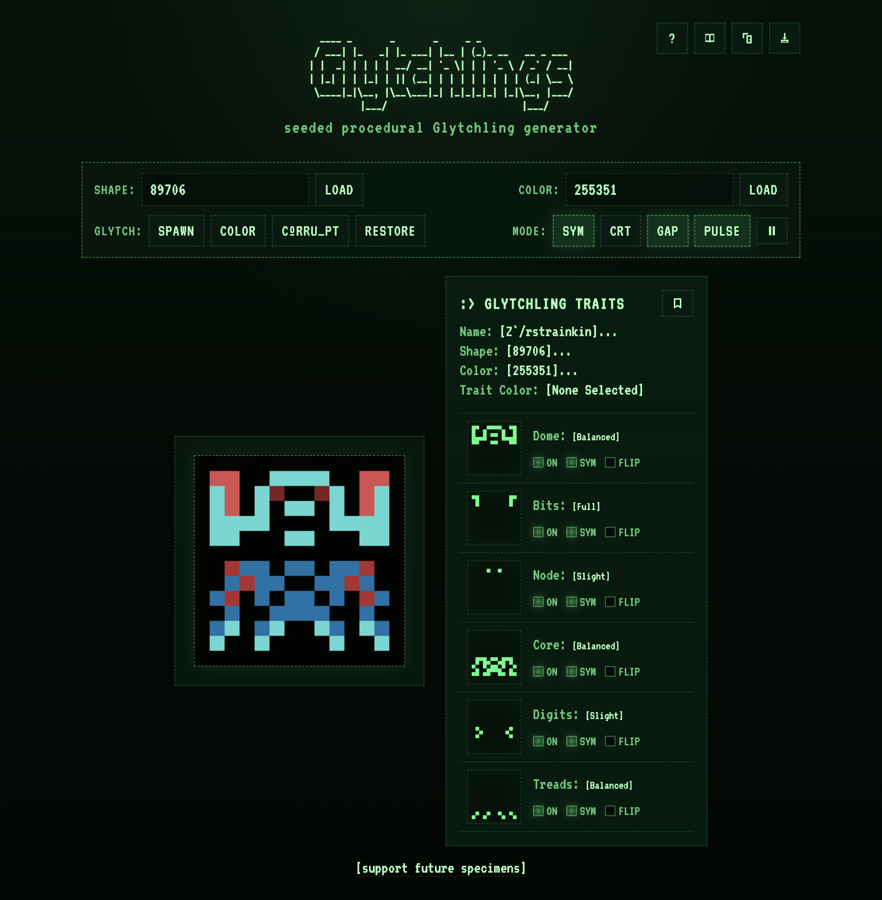
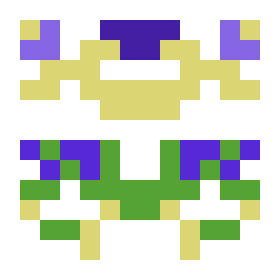
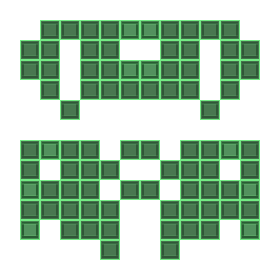
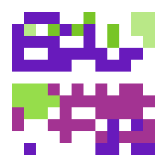

# Glytchlings

<table>
  <tr>
    <td></td>
  </tr>
  <tr>
    <td><em>App Screenshot · ?shape=89706&color=255351</em></td>
  </tr>
</table>

## System Readout

Glytchlings is a seeded procedural Glytchling generator built as a small static web app.

Each Glytchling is generated from deterministic shape and color seeds. That means the same `shape` and `color` values will always recreate the same Glytchling and palette, which makes sharing, saving favorites, and reusing seeds across other projects straightforward.

View the live site: [heitzmike.github.io/glytchlings/](https://heitzmike.github.io/glytchlings/)
Like this project and want to help support? [Buy Me A Coffee!](https://buymeacoffee.com/heitzstudio)

## Specimen Variants

<table>
  <tr>
    <td></td>
    <td></td>
    <td></td>
  </tr>
  <tr>
    <td><em>Balanced · ?shape=453039&color=418255</em></td>
    <td><em>CRT · ?shape=888388&color=490005</em></td>
    <td><em>Corrupt · ?shape=811152&color=633740</em></td>
  </tr>
</table>

## Capabilities

- Generates mirrored or asymmetrical pixel Glytchlings from a shape seed
- Generates palettes independently from a color seed
- Builds each Glytchling from modular parts like dome, core, node, bits, digits, and treads
- Uses weighted randomness in several part regions so generated silhouettes feel varied without becoming pure noise
- Generates a deterministic glitchy name from seeded syllable pools with occasional character mutations
- Lets you inspect each generated trait individually
- Supports per-part toggles for `on`, `sym`, and `flip`
- Includes a local `Specimen Log` for adding favorite Glytchlings with their current trait and mode settings
- Can copy a shareable URL with the current `shape` and `color` and any trait and mode settings
- Can download the current render as a PNG

## Generation Logic

The app is split into a few small pieces:

- [`index.html`](./index.html): page shell, styling, and toolbar/inspector layout
- [`app.js`](./app.js): browser-side UI state, rendering, animation, share/download behavior, and URL syncing
- [`glytchlingGenerator.js`](./glytchlingGenerator.js): deterministic Glytchling generation, part masks, traits, palette generation, and naming

Generation is deterministic, so the same inputs always produce the same result:

- `shape` controls the Glytchling structure
- `color` controls the palette

Part generation is not uniform random. Several sections use weighted randomness inside fixed zones, which helps the results stay readable while still feeling surprising from seed to seed.

The current URL is kept in sync like this:

```text
?shape=123456&color=789012
```

Opening that link later will restore the same Glytchling and color scheme.

## Utility Menu (top icon bar)

- help icon: opens the `System Help` menu with app functionality explanation
- book icon: opens the `Specimen Log` and lets you save/load favorite Glytchlings in local browser storage
- copy icon: copies the current Glytchling URL
- download icon: downloads the current canvas as a PNG using a filesystem-safe version of the Glytchling name, unsafe characters replaced with '-'

## Control Panel

### Shape

- `Load`: load a specific shape seed

### Color

- `Load`: load a specific color seed

### Glytch

- `Spawn`: generate a new shape seed and color seed with current trait toggles and mode settings
- `Color`: generate a new palette with current shape, trait toggles, and mode settings
- `Cºrru_pt`: adds pure chaos, randomize trait toggles and some mode settings
- `Restore`: return the trait/mode controls to a clean default state

### Mode

- `Sym`: toggle symmetry on all trait parts
- `CRT`: render the Glytchling in a terminal-style CRT view
- `Gap`: toggle the dome/core gap
- `Pulse`: toggle dome motion
- pause icon: freeze the current pulse frame for saving/downloading

## Trait Panel

The inspector shows:

- `Name`
- `Shape`
- `Color`
- `Trait Color` for currently selected trait
- a bookmark icon for quick add to `Specimen Log`

Each trait row includes:

- a mini preview mask
- the current generated value
- `on`: enable or disable that part
- `sym`: mirror that part left/right
- `flip`: swap the asymmetry side for that part

Hovering or clicking a trait highlights the corresponding area on the main Glytchling.

## Local Boot

This project is completely static, so you do not need a build step or dependencies.

Clone the repo, then serve the folder with any simple local web server.

### Option 1: `npx serve`

```bash
npx serve
```

Then open the local URL shown in the terminal.

### Option 2: Python

```bash
python3 -m http.server
```

Then open:

```text
http://localhost:8000
```

### Option 3: VS Code Live Server

If you use VS Code, you can also open the folder and run it with the Live Server extension.

## System Notes

- Favicons and manifest files are already included for basic browser/mobile support
- The favicon is based on this Glytchling: `?shape=89706&color=255351`
- Clipboard copy may behave differently across browsers, so the app includes a fallback copy path for mobile compatibility
- The generator code is intentionally deterministic so seeds can be reused outside this app

## Origin

Developed by [HeitzMike](https://github.com/HeitzMike).

Glytchlings started as a way to explore deterministic generation for another project, then grew into its own weird little pixel experiment.

The project was inspired in part by the generative space-invader work of [f2d](https://github.com/f2d/random_ship_generator) and by the task fish tank of [MewTru](https://www.instagram.com/mewtru/).
